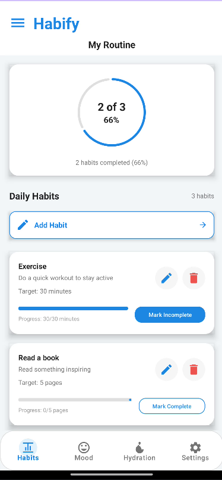
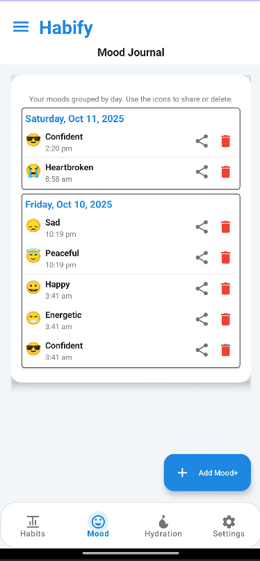
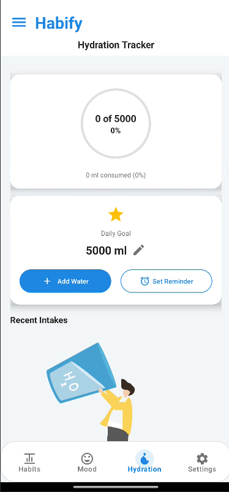
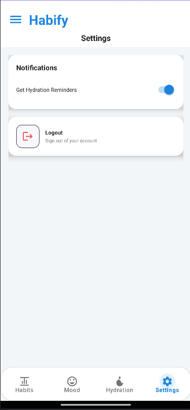

# 🌟 Habify - Your Personal Wellness Companion

<div align="center">


**Transform your daily routine into a journey of wellness and self-discovery**

[](https://github.com/yourusername/habify/releases)
[](LICENSE)
[](https://github.com/yourusername/habify)

</div>

---

## 🎯 What is Habify?

**Habify** is a comprehensive wellness tracking app designed to help you build healthy habits, monitor your emotional well-being, and stay hydrated throughout your day. Whether you're starting your wellness journey or looking to optimize your existing routine, Habify provides the tools and insights you need to thrive.

### ✨ Key Features

<table>
<tr>
<td width="50%">

#### 🏃‍♂️ **Habit Tracking**
- Create and manage daily habits
- Track progress with visual indicators
- Monitor streaks and completion rates
- Customizable targets and units
- Widget support for quick access

</td>
<td width="50%">

#### 💧 **Smart Hydration**
- Set personalized daily water goals
- Quick-add water intake with preset amounts
- Smart reminder notifications
- Visual progress tracking
- Hydration history and analytics

</td>
</tr>
<tr>
<td width="50%">

#### 😊 **Mood Journal**
- Express emotions with intuitive emoji system
- Add personal notes and context
- View mood trends and patterns
- Calendar view for mood history
- Share mood summaries

</td>
<td width="50%">

#### 📊 **Analytics & Insights**
- Beautiful charts and progress visualization
- Streak tracking and statistics
- Goal completion rates
- Historical data analysis
- Export and sharing capabilities

</td>
</tr>
</table>

---

## 🚀 Features in Detail

### 🎨 **Modern UI/UX**
- **Material Design 3** implementation
- **Dark/Light theme** support
- **Intuitive navigation** with bottom navigation
- **Smooth animations** and transitions
- **Accessibility** features included

### 🔔 **Smart Notifications**
- **Hydration reminders** with customizable intervals
- **Habit completion** notifications
- **Boot-up persistence** for alarms
- **Permission handling** for Android 12+

### 📱 **Android Widget**
- **Home screen widget** for quick habit tracking
- **Real-time progress** updates
- **One-tap completion** of habits
- **Customizable appearance**

### 🔒 **Privacy & Security**
- **Local data storage** with SharedPreferences
- **No cloud dependencies**
- **Offline functionality**
- **Secure data handling**

---

## 🛠️ Technical Stack

### **Core Technologies**
- **Kotlin** - Modern Android development
- **Android SDK 24+** - Wide device compatibility
- **Material Design 3** - Latest design guidelines
- **View Binding** - Type-safe view references

### **Architecture & Libraries**
- **MVVM Architecture** - Clean separation of concerns
- **Fragment-based Navigation** - Modular UI components
- **WorkManager** - Reliable background tasks
- **MPAndroidChart** - Beautiful data visualization
- **RecyclerView** - Efficient list rendering

### **Key Dependencies**
```kotlin
// Core Android
implementation("androidx.core:core-ktx:1.12.0")
implementation("androidx.appcompat:appcompat:1.6.1")
implementation("com.google.android.material:material:1.11.0")

// Navigation & UI
implementation("androidx.navigation:navigation-fragment-ktx:2.8.2")
implementation("androidx.recyclerview:recyclerview:1.3.2")

// Background Tasks
implementation("androidx.work:work-runtime-ktx:2.9.1")

// Charts & Visualization
implementation("com.github.PhilJay:MPAndroidChart:v3.1.0")
```

---

## 📱 Visuals

<div align="center">

<table style="margin: 0 auto;">
<tr>
<td align="center"><strong>Habits Dashboard</strong></td>
<td align="center"><strong>Mood Tracking</strong></td>
</tr>
<tr>
<td align="center"></td>
<td align="center"></td>
</tr>
</table>

<br>

<table style="margin: 0 auto;">
<tr>
<td align="center"><strong>Hydration Tracker</strong></td>
<td align="center"><strong>Settings</strong></td>
</tr>
<tr>
<td align="center"></td>
<td align="center"></td>
</tr>
</table>

</div>

---

## 🚀 Getting Started

### **Prerequisites**
- Android Studio Arctic Fox or later
- Android SDK 24+ (Android 7.0+)
- Kotlin 1.8+
- Gradle 7.0+

### **Installation**

1. **Clone the repository**
   ```bash
   git clone https://github.com/yourusername/habify.git
   cd habify
   ```

2. **Open in Android Studio**
   - Launch Android Studio
   - Select "Open an existing project"
   - Navigate to the cloned directory

3. **Sync dependencies**
   ```bash
   ./gradlew build
   ```

4. **Run the app**
   - Connect an Android device or start an emulator
   - Click the "Run" button in Android Studio

### **Building from Source**

```bash
# Debug build
./gradlew assembleDebug

# Release build
./gradlew assembleRelease

# Run tests
./gradlew test
```

---

## 📖 Usage Guide

### **Getting Started**
1. **Launch the app** and complete the onboarding
2. **Set up your habits** - Add daily routines you want to track
3. **Configure hydration** - Set your daily water goal and reminders
4. **Start tracking** - Log your mood and complete habits daily

### **Creating Habits**
- Tap the "+" button in the Habits tab
- Enter habit name, description, and target
- Choose appropriate units (times, minutes, glasses, etc.)
- Set daily goals and start tracking

### **Mood Tracking**
- Select your current mood from the emoji grid
- Add optional notes for context
- View your mood history and trends
- Share your mood summary with others

### **Hydration Management**
- Set your daily water goal (default: 2000ml)
- Use quick-add buttons for common amounts
- Enable smart reminders for regular intervals
- Track your progress throughout the day

---

## 🎨 Customization

### **Themes**
- **Light Theme** - Clean and minimal design
- **Dark Theme** - Easy on the eyes for low-light usage
- **Auto Theme** - Follows system preferences

### **Habit Categories**
- **Fitness** - Exercise, steps, workouts
- **Wellness** - Meditation, sleep, self-care
- **Learning** - Reading, courses, skills
- **Productivity** - Work tasks, goals, projects

### **Widget Customization**
- **Size options** - 2x1, 4x1, 4x2
- **Color themes** - Match your home screen
- **Habit selection** - Choose which habits to display

---

## 🤝 Contributing

We welcome contributions! Here's how you can help:

### **Ways to Contribute**
- 🐛 **Report bugs** - Help us improve stability
- 💡 **Suggest features** - Share your ideas
- 📝 **Improve documentation** - Make it clearer
- 🔧 **Submit pull requests** - Fix issues or add features

### **Development Setup**
1. Fork the repository
2. Create a feature branch: `git checkout -b feature/amazing-feature`
3. Make your changes
4. Test thoroughly
5. Commit: `git commit -m 'Add amazing feature'`
6. Push: `git push origin feature/amazing-feature`
7. Open a Pull Request

### **Code Style**
- Follow Kotlin coding conventions
- Use meaningful variable names
- Add comments for complex logic
- Write unit tests for new features

---

## 📋 Roadmap

### **Version 1.1** (Coming Soon)
- [ ] **Data Export** - Export habits and mood data
- [ ] **Backup & Restore** - Cloud backup functionality
- [ ] **Advanced Analytics** - More detailed insights
- [ ] **Habit Templates** - Pre-made habit suggestions

### **Version 1.2** (Future)
- [ ] **Social Features** - Share progress with friends
- [ ] **Challenges** - Monthly wellness challenges
- [ ] **Integration** - Health apps and wearables
- [ ] **AI Insights** - Personalized recommendations

### **Long-term Goals**
- [ ] **iOS Version** - Cross-platform support
- [ ] **Web Dashboard** - Desktop companion
- [ ] **Team Features** - Family/group tracking
- [ ] **Professional** - Corporate wellness

---

## 🐛 Known Issues

- **Widget updates** may be delayed on some devices
- **Notification permissions** require manual setup on Android 12+
- **Large datasets** may impact performance on older devices

### **Troubleshooting**
- **Notifications not working?** Check app permissions in Settings
- **Widget not updating?** Try removing and re-adding the widget
- **Data not saving?** Ensure you have sufficient storage space

---

## 📄 License

This project is licensed under the **MIT License** - see the [LICENSE](LICENSE) file for details.

```
MIT License

Copyright (c) 2024 Habify

Permission is hereby granted, free of charge, to any person obtaining a copy
of this software and associated documentation files (the "Software"), to deal
in the Software without restriction, including without limitation the rights
to use, copy, modify, merge, publish, distribute, sublicense, and/or sell
copies of the Software, and to permit persons to whom the Software is
furnished to do so, subject to the following conditions:

The above copyright notice and this permission notice shall be included in all
copies or substantial portions of the Software.
```

---

## 🙏 Acknowledgments

- **Material Design** team for the beautiful design system
- **Android community** for excellent libraries and resources
- **Open source contributors** who make projects like this possible
- **Beta testers** who provided valuable feedback

---

## 📞 Support & Contact

- **Issues**: [GitHub Issues](https://github.com/yourusername/habify/issues)
- **Discussions**: [GitHub Discussions](https://github.com/yourusername/habify/discussions)
- **Email**: support@habify.app
- **Website**: [habify.app](https://habify.app)

---

<div align="center">

### ⭐ Star this repository if you found it helpful!

**Made with ❤️ for the wellness community**

[](https://github.com/yourusername/habify/stargazers)
[](https://github.com/yourusername/habify/network/members)
[](https://github.com/yourusername/habify/watchers)

</div>
